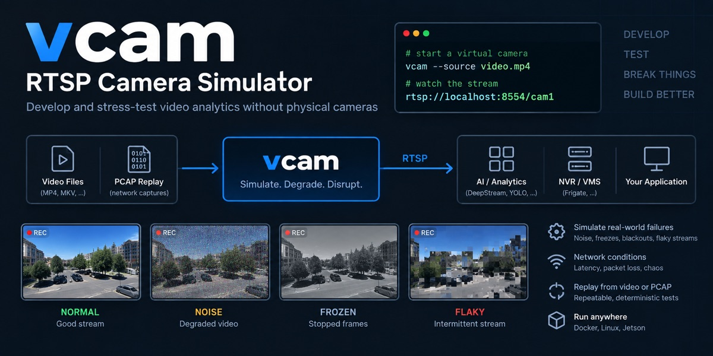

<div align="center">



# vcam — RTSP Camera Simulator

**Develop and stress-test video analytics without physical cameras.**

[](https://github.com/antowan/virtual-rtsp-camera/actions/workflows/ci.yml)
[](https://github.com/antowan/virtual-rtsp-camera/releases)
[](https://hub.docker.com/r/konekuto/vcam)
[](LICENSE)

</div>

`vcam` turns local video files into **looping virtual RTSP camera streams**, so video
analytics pipelines — NVIDIA DeepStream, Frigate, or any RTSP-based CCTV/NVR software —
can be developed and tested without physical IP cameras.

```bash
# no clip handy? generate a few throwaway samples first:
docker run --rm -v "$PWD/videos:/vcam/videos" \
  --entrypoint /opt/vcam/scripts/make-sample-videos.sh konekuto/vcam /vcam/videos

docker run --rm -p 8554:8554 -v "$PWD/videos:/vcam/videos:ro" \
  konekuto/vcam run --source /vcam/videos/cam1.mp4
# -> rtsp://localhost:8554/cam1
```

## Why vcam?

- **No cameras needed** — serve many cameras from one port, one path per camera
  (`rtsp://host:8554/cam1`, `/cam2`, …), looping forever and paced in real time.
- **Break things on purpose** — [seven simulation modes](docs/simulation-modes.md)
  (noise, frozen, blackout, flaky, …) reproduce camera faults deterministically, and an
  optional [Toxiproxy sidecar](docs/network-chaos.md) injects network-layer chaos.
- **Replay the real thing** — [replay packet captures](docs/capture-replay.md) from
  actual cameras byte for byte when a synthetic feed is not faithful enough.
- **Runs anywhere** — multi-arch Docker image (amd64 + arm64, including Jetson edge
  devices), Python CLI, or a [systemd/launchd service](docs/service.md).

## Quick start

One camera from one file:

```bash
uv run vcam run --source videos/cam1.mp4
# -> rtsp://127.0.0.1:8554/cam1
```

Several cameras on the same port, different paths:

```bash
uv run vcam run \
  --camera cam1=videos/cam1.mp4 \
  --camera cam2=videos/cam2.mp4 \
  --camera cam3=videos/cam3.mp4
```

Read a stream back:

```bash
ffprobe -rtsp_transport tcp rtsp://127.0.0.1:8554/cam1
ffplay  -rtsp_transport tcp rtsp://127.0.0.1:8554/cam1
```

Make a camera misbehave:

```bash
# drops off the network for 5s every 30s
uv run vcam run -s videos/cam1.mp4 --simulation flaky \
  --simulation-interval 30 --simulation-duration 5
```

## Install

**Docker** (no local setup needed) — multi-arch image on Docker Hub,
[`konekuto/vcam`](https://hub.docker.com/r/konekuto/vcam):

```bash
docker pull konekuto/vcam:latest
```

**Python CLI** — requires Python ≥ 3.10, [uv](https://docs.astral.sh/uv/), and
`ffmpeg`/`ffprobe` on `PATH`:

```bash
uv sync                 # dev install into ./.venv
uv run vcam --help
uv run vcam doctor      # check your environment
```

Or install the CLI globally:

```bash
uv tool install .
vcam --help
```

Capture replay needs `scapy`, an optional extra:

```bash
uv sync --extra replay          # or: pip install 'vcam[replay]'
```

## How it works

Under the hood the tool runs a [MediaMTX](https://github.com/bluenviron/mediamtx) server
(auto-downloaded for your architecture, SHA-256 verified) and one `ffmpeg` publisher per
camera, restarted automatically if it dies. [Capture replay](docs/capture-replay.md)
bypasses both and serves recorded packets from its own RTSP server, so nothing
re-packetises the stream on the way out.

`--mode` controls what happens between the file and the wire:

| mode | behaviour |
| --- | --- |
| `auto` *(default)* | probe the file; **copy** when it is already H.264/HEVC, otherwise **transcode** |
| `copy` | pure passthrough — just read the video and stream it, no re-encode, near-zero CPU |
| `transcode` | re-encode with the resolution / fps / bitrate / codec / GOP you ask for |

```bash
# force a 720p15 2 Mbit/s H.264 feed regardless of the source
uv run vcam run -s videos/cam1.mp4 \
  --mode transcode --resolution 1280x720 --fps 15 --bitrate 2M --gop 30

# inspect a file and see which mode `auto` would pick
uv run vcam probe videos/cam1.mp4
```

## Configuration

For anything beyond a couple of cameras, use a YAML file — `vcam run` picks up
`./cameras.yaml` automatically:

```bash
uv run vcam init -s videos/cam1.mp4 -s videos/cam2.mp4   # write a seeded config
uv run vcam list                                          # table of cameras and URLs
```

```yaml
cameras:
  - name: cam1
    source: videos/cam1.mp4
  - name: grainy
    source: videos/cam2.mp4
    simulation:
      mode: noise
      noise_level: 60
```

Full reference: [docs/configuration.md](docs/configuration.md) — ports, auth, health
file, `start_offset`, legacy manifests, and the MediaMTX binary resolution order.

## Documentation

| Doc | What's in it |
| --- | --- |
| [Simulation modes](docs/simulation-modes.md) | noise, degraded, frozen, blackout, flaky, stutter, custom filters |
| [Capture replay](docs/capture-replay.md) | replay `tcpdump` captures byte for byte, looping, redaction |
| [Network chaos](docs/network-chaos.md) | Toxiproxy sidecar: latency, bandwidth, stalls, disconnects |
| [Configuration](docs/configuration.md) | full `cameras.yaml` reference, auth, health file, server binary |
| [Clock sync](docs/clock-sync.md) | RTCP NTP timestamps, container time sync, skew testing |
| [Running as a service](docs/service.md) | systemd (Linux) and launchd (macOS) installation |
| [Docker](docs/docker.md) | image details, compose, multi-arch builds, aarch64/Jetson |
| [Cheat sheet](CHEATSHEET.md) | one-page command map |

## Development

```bash
uv sync
uv run pytest
```

CI gates the same three checks, so run them before pushing:

```bash
uv run ruff check .          # lint (pyflakes, import order, pyupgrade, bugbear)
uv run ruff format --check . # formatting, 100 columns
uv run mypy                  # type check src/vcam
```

`ruff check --fix` and `ruff format` apply the mechanical fixes.

## Contributing

Contributions are welcome, but this repository is intentionally maintained with a narrow
scope to keep it sustainable. For non-trivial changes, open an issue first and wait for
maintainer feedback. See [CONTRIBUTING.md](CONTRIBUTING.md) and
[CODE_OF_CONDUCT.md](CODE_OF_CONDUCT.md) for details.

## License

[MIT](LICENSE)
